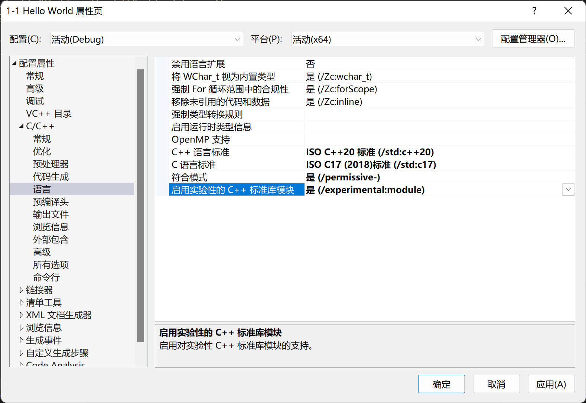
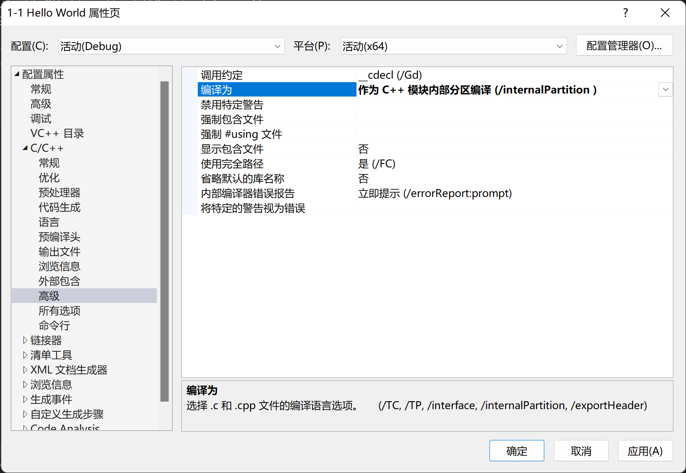

# Professional C++

## 在 VS 2022 中启用 C++ 20

项目 -> 属性 -> C/C++ -> 语言

1. C++ 语言标准：ISO C++ 20 标准（/std:c++20）
2. 启用实验性的 C++ 标准库模块：是（/experimental:module）

  

项目 -> 属性 -> C/C++ -> 高级

1. 编译为：作为 C++ 模块内部分区编译（/internalPartition）

  

项目 -> 导出模板