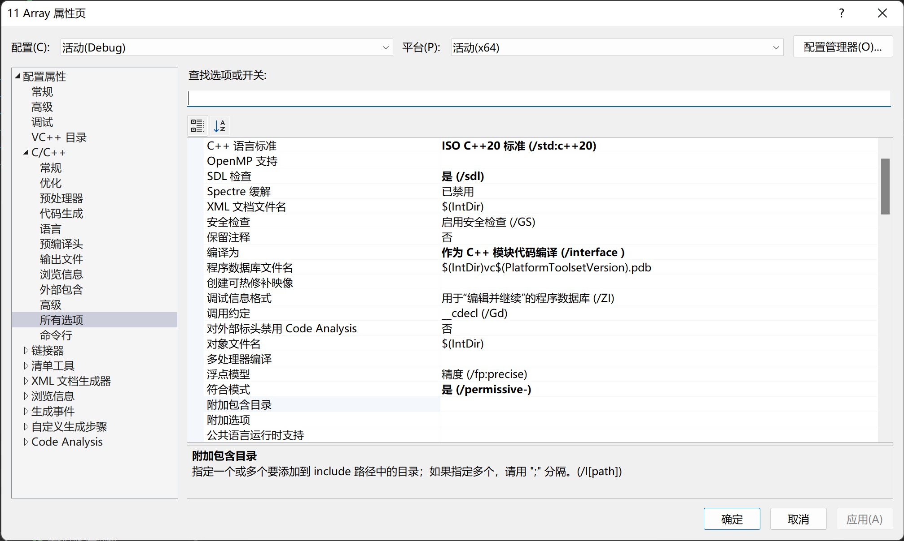

# Professional C++

## 在 VS 2022 中启用 C++ 20

1. 项目 -> 属性 -> C/C++ -> 语言
    1. C++ 语言标准：ISO C++ 20 标准（/std:c++20）
    2. 启用实验性的 C++ 标准库模块：是（/experimental:module）
    
2. 项目 -> 属性 -> C/C++ -> 高级
    1. 编译为：作为 C++ 模块代码编译 (/interface )
    
      
3. 项目 -> 导出模板
    1. 导出的模板会被放在 Documents\Visual Studio 2022\My Exported Templates 下
    2. VS 的模板放在 C:\Users\yangdong\Documents\Visual Studio 2022\Templates 下，可以手动管理。

## 笔记

1. Chapter 1
    1. [3 种 ordering](1-9%20Logical%20Evaluation%20Operators/README.md)
    2. [在模块中定义类](19%20Classes/README.md)
